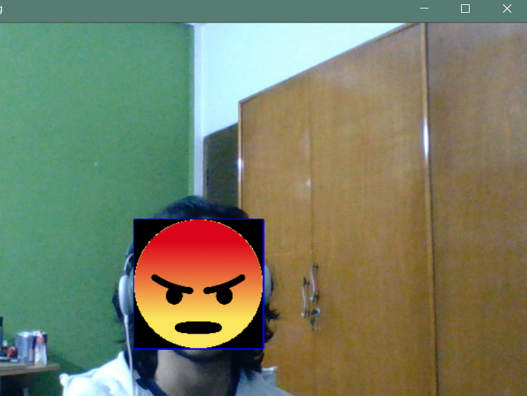

# Opencv-face-replacement
A python based application that allows a user to replace his face with a custom image in real time video based on a rectangular contour.
The haar-cascade open source package has been used to develop this app.
### Required Python Libraries on Local Machine:
* cv2

#### An instance of the app.

